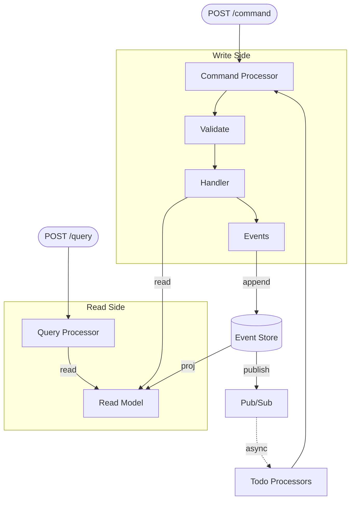

# Grain

Opinionated building blocks for AI-native information systems in Clojure.

## What is Grain?

Grain is a set of composable building blocks for building event-sourced information systems using CQRS (Command Query Responsibility Segregation). The event store is the single source of truth — humans, application code, and AI agents share one ledger of facts: same store, same constraints, same audit trail.

The constraints are deliberately *shallow*: a small set of foundational rules that bottom out at the storage layer. When natural language is the compiler — when an LLM is translating intent into code — the codebase it targets is what bounds the space of valid outputs. Grain narrows that space until drift becomes structurally impossible.

## Why Grain?

We use [Event Modeling and Event Sourcing](https://leanpub.com/eventmodeling-and-eventsourcing) to design [Simple](https://www.youtube.com/watch?v=SxdOUGdseq4) systems. Grain provides a single, composable toolkit for building multi-tenant, event-sourced applications in Clojure.

[Polylith](https://polylith.gitbook.io/polylith) enables us to evolve components independently and publish standalone tools from a single repository.

## Architecture



**Commands** are the only path to state change — they validate business rules and emit events. **Events** are immutable facts stored in the event store. **Queries** read from projections (read models) built from events. **Todo Processors** react to events asynchronously, enabling event-driven workflows.

## Core Concepts

> Full documentation with code examples: [docs/core-concepts.md](docs/core-concepts.md)

- **Commands** — the only path to state change. Validate business rules and emit events.
- **Events** — immutable facts stored in the event store. Body fields, tags, UUID v7 IDs.
- **Queries** — read from projections without side effects.
- **Read Models** — pure reducers `(state, event) -> state` with two-tier caching (in-process LRU + LMDB on disk).
- **Todo Processors** — react to events asynchronously with configurable checkpointing (at-most-once or at-least-once).
- **Periodic Tasks** — run on cron or interval schedules with CAS deduplication across nodes.
- **Authorization** — all commands and queries require an `:authorized?` predicate. Deny by default.

## Multi-Tenancy

Every event-store operation is scoped to a `:tenant-id`, and the Postgres backend enforces isolation with Row-Level Security and per-tenant advisory locks. Start with an in-memory event store for quick iteration, then swap in SQLite for embedded single-process deployments or Postgres for multi-instance — a single line change either way.

For multi-instance deployments, an opt-in control plane coordinates tenant assignment across nodes using event-sourced leases — no external coordination service required.

## Distributed Coordination

> Full documentation: [docs/distributed-coordination.md](docs/distributed-coordination.md)

The `grain-control-plane` package provides coordinator election, tenant lease management, and tenant-aware routing — all event-sourced on the shared Postgres event store. No external coordination service required.

## Datastar (Reactive UI)

> Full documentation: [docs/datastar.md](docs/datastar.md) | UI DSL: [docs/datastar-ui.md](docs/datastar-ui.md)

Grain integrates with [Datastar](https://data-star.dev/) for reactive server-rendered UIs. Queries return hiccup that streams to the browser over SSE — the server re-renders when domain events fire and Datastar patches the DOM. In multi-node deployments, the event tailer can feed each node's local pub/sub from the shared event store so live updates reach the node holding the SSE connection.

## Code Agent Tools

> Full documentation: [docs/code-agent-tools.md](docs/code-agent-tools.md)

The `grain-code-agent-tools` package provides dev-only nREPL tools for coding agents working against a live Grain app. Agents can inspect registered commands, queries, read models, processors, periodic triggers, schemas, projections, events, and runtime diagnostics as plain EDN, then validate payloads against the schema registry before invoking commands or queries.

## Getting Started

Add to your `deps.edn`:

```clojure
obneyai/grain-core-v2
{:git/url "https://github.com/ObneyAI/grain.git"
 :git/sha "dd2e21f1ad69d7715d0afed0f6deb0993a6a7b27" ;; update to latest commit sha
 :deps/root "projects/grain-core-v2"}
```

See `bases/example-base` and `components/example-service` for a complete example application. Run `development/src/example_app_demo.clj` to start and interact with the example system.

For multi-instance deployments, add the [control plane](docs/distributed-coordination.md) package.

## Example App: Grain Todo List

[`grain-todo-list`](https://github.com/ObneyAI/grain-todo-list) is a compact teaching app for learning how to build with Grain. It demonstrates command handlers, event schemas, read models, query handlers, todo processors, periodic tasks, server-rendered Datastar UI, auth/session flow, and Integrant system composition in a small Clojure project.

The app repository includes its own [README](https://github.com/ObneyAI/grain-todo-list/blob/main/README.md), agent notes in [`AGENTS.md`](https://github.com/ObneyAI/grain-todo-list/blob/main/AGENTS.md), and a deeper architecture reference in [`doc/pattern-compendium.md`](https://github.com/ObneyAI/grain-todo-list/blob/main/doc/pattern-compendium.md).

Grain Sessions walks through the app as a teaching series:

- [Episode 1](https://youtu.be/tO--joFrYUE)
- [Episode 2](https://youtu.be/plMAG4FASdk)
- [Episode 3](https://youtu.be/weAsNioiEnI)
- [Episode 4](https://youtu.be/XRo49q6yCeo)
- [Episode 5](https://youtu.be/JdQtSLHoCQk)

## Packages

> Full package details and deps.edn snippets: [docs/packages.md](docs/packages.md)

| Package | Summary |
| --- | --- |
| **grain-core-v2** | Multi-tenant CQRS/Event Sourcing with in-memory event store and event tailing |
| **grain-control-plane** | Distributed coordination — coordinator election, tenant leases, routing |
| **grain-datastar** | Reactive server-rendered UIs with [Datastar](https://data-star.dev/) over SSE, including distributed live updates |
| **grain-code-agent-tools** | Dev-only nREPL tools for coding agents working against live Grain apps |
| **grain-event-store-postgres-v3** | Multi-tenant Postgres backend with RLS, per-tenant advisory locks, and Fressian serialization |
| **grain-event-store-sqlite-v3** | Embedded single-process backend — WAL mode, tenant-scoped events with indexed tag filtering, Fressian serialization |
| **grain-mulog-aws-cloudwatch-emf-publisher** | AWS CloudWatch metrics & dashboards |

## Status

Grain is MIT licensed. We use it in production, but it's actively evolving. The core CQRS/Event Sourcing components are stable. The control plane is new and under active development.

## More Information

- **Docs**: [Core Concepts](docs/core-concepts.md) | [Distributed Coordination](docs/distributed-coordination.md) | [Datastar](docs/datastar.md) | [Datastar UI](docs/datastar-ui.md) | [Code Agent Tools](docs/code-agent-tools.md) | [Packages](docs/packages.md)
- **Examples**: [`grain-todo-list`](https://github.com/ObneyAI/grain-todo-list), `bases/example-base`, `components/example-service`, `development/src/example_app_demo.clj`
- **Talks**: [*Agentic Workflows with Grain*](https://www.youtube.com/watch?v=hvchFTa5z0I) (Scicloj #11, Sep 2025) | [*Practicing Grain*](https://www.youtube.com/watch?v=IUzXfvOH2t0) (Scicloj #12, Oct 2025)
- **Slack**: [#grain](https://clojurians.slack.com/archives/C099K3D7XRV) on Clojurians
- **Issues**: [GitHub Issues](https://github.com/ObneyAI/grain/issues)
